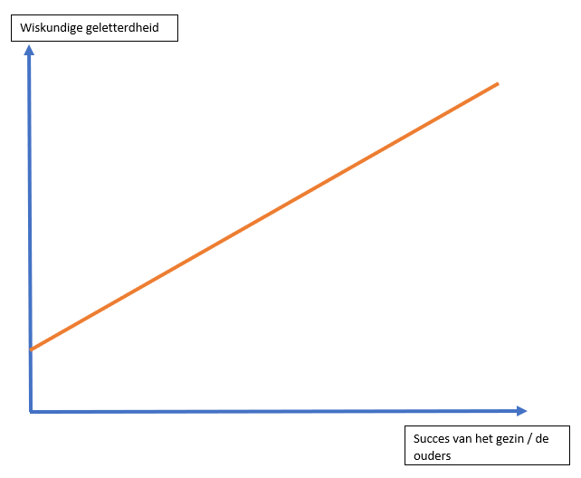

# Hypothese

## Onderzoeksvraag

Zijn mensen die uit een succesvol gezin komen meer wiskundig geletterd dan mensen die uit minder succesvolle gezinnen komen?

## Toelichting

We gaan onderzoeken of de graad van succes van het gezin / de ouders invloed heeft op hoe wiskundig geletterd de kinderen zijn.
Onder succes verstaan we dat de ouders een hoog diploma hebben, dus een master opleiding of bachelor opleiding gevolgd hebben. Alsook bepaalt het inkomen en de werkfunctie van de ouders het succes van het gezin.

Als groep denken we dat de succesgraad van het gezin een bepaalde positieve invloed heeft op de wiskundige geletterdheid van de kinderen.

## Selectie variabelen

Voor het onderzoek gaan we volgende variabelen gebruiken:
1. Afhankelijke variabelen
   - Inkomen van de ouders (`FamilyIncome`)
   - Behaald diploma van de ouders (`EducationFather` & `EducationMother`)
   - De werkfunctie van beide ouders (`OccupationFather` & `OccupationMother`)

2. Onafhankelijke variabelen
   -  Testresultaten van Math4IT van de student (`GradeMath4IT`)
   -  Testresultaten van Probleem Oplossend Denken 1 (`GradePOD1`)

## Schets verwachte resultaten

## Bronnen

https://www.pisa.ugent.be/uploads/assets/103/1394536156566-PISA2012%20rapport.pdf

https://www.uu.nl/sites/default/files/research_program_fi_2015-2020.pdf 

https://www.quora.com/Is-it-possible-to-have-a-very-high-IQ-without-being-good-at-math

https://www.psychologytoday.com/us/blog/look-it-way/200906/whats-iq-all-about-two-things 